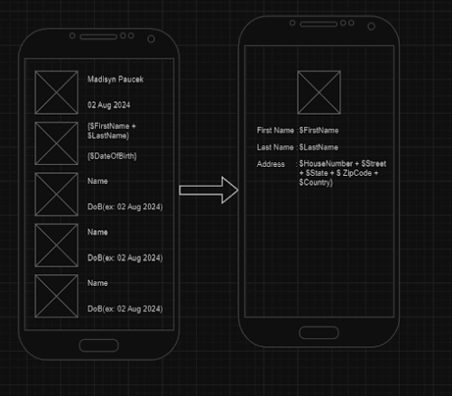

# PCS-Technical-Test
Android - PCS Technical Test

## Diskripsi
Proyek ini merupakan contoh aplikasi Android modern yang mengutamakan efisiensi, skalabilitas, dan kemudahan pengujian.
Tujuan dari project ini adalah sebagai berikut:
- Menerapkan arsitektur MVVM untuk meningkatkan skalabilitas dan pemeliharaan aplikasi.
- Menggunakan Dagger HILT untuk mempermudah pengelolaan dependensi dan memastikan kode yang lebih bersih.
- Mengintegrasikan komunikasi dengan API melalui Retrofit, memastikan data dapat diambil dan dikelola secara efisien.
- Memanfaatkan ViewBinding untuk akses elemen UI yang aman dan mengurangi risiko kesalahan runtime.
- Membangun aplikasi dengan struktur Multi Module untuk kemudahan pengujian, dan pemisahan fungsionalitas.

## Fitur Utama
> * Dagger HILT
> * MVVM architecture (include usecase, repository)
> * Retrofit
> * ViewBinding
> * Multi Module Application3
